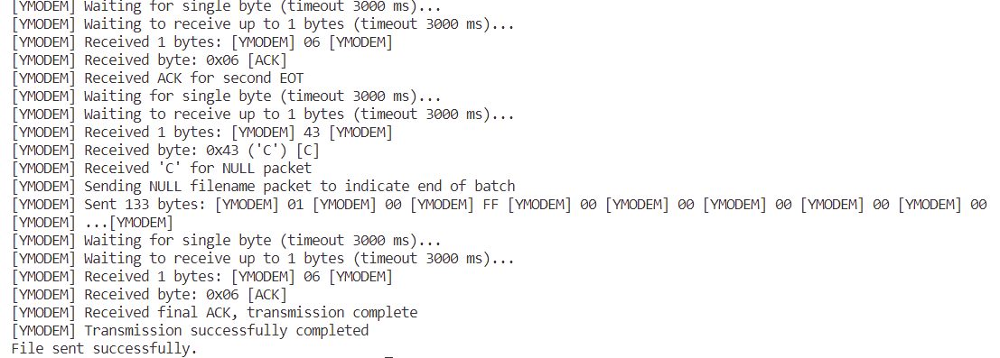

# YMODEM Protocol Implementation

[](LICENSE)

**Read this in other languages: [English](README.md), [中文](README-CN.md).**

## Overview

This is a portable YMODEM protocol implementation in C, designed for embedded systems and inspired by [RT-Thread](https://www.rt-thread.org/). The implementation is highly configurable, has minimal dependencies, and supports both sending and receiving files.

## Features

- Complete YMODEM protocol implementation with CRC16 error checking
- Support for both 128-byte and 1024-byte packets
- Callback-based design for maximum portability
- Minimal RAM footprint
- Support for both file sending and receiving
- Cross-platform compatibility
- No external dependencies except for standard C libraries
- Comprehensive error handling and timeout management

## Architecture

The YMODEM implementation is divided into three main components:

1. **Common Module**: Contains shared functions, definitions, and data structures
2. **Sender Module**: Implements YMODEM file sending functionality
3. **Receiver Module**: Implements YMODEM file receiving functionality

## Directory Structure

```
ymodem/
├── examples/
│   └── demo.c       # demo
├── include/
│   ├── ymodem_common.h      # Common utility functions
│   ├── ymodem_send.h        # Sender API
│   └── ymodem_receive.h     # Receiver API
├── src/
│   ├── ymodem_common.c      # Common definitions and data structures
│   ├── ymodem_send.c        # Sender implementation
│   └── ymodem_receive.c     # Receiver implementation
├── Makefile
└── README.md                # this file
```

## Usage

Note: If you don't need to debug, you should disable the macro definition "DYMODEM_DEBUG_ENABLE"!!!!
### Initialize Callbacks

First, you need to initialize the callback functions to interface with your hardware and file system:

```c
ymodem_callbacks_t callbacks = {
    // File operations
    .file_open = my_file_open,
    .file_read = my_file_read,
    .file_write = my_file_write,
    .file_close = my_file_close,
    .file_size = my_file_size,
    
    // Communication
    .comm_send = my_uart_send_byte,
    .comm_receive = my_uart_receive_byte,
    
    // Timing (optional)
    .get_time_ms = my_get_time_ms,
    .delay_ms = my_delay_ms
};
```

### Sending a File

```c
// Initialize YMODEM context
ymodem_context_t ctx;
uint8_t buffer[YMODEM_MAX_PACKET_SIZE];

// Initialize sender
int ret = ymodem_send_init(&ctx, &callbacks, buffer, sizeof(buffer));
if (ret != YMODEM_ERR_NONE) {
    // Handle error
}

// Send file
ret = ymodem_send_file(&ctx, "filename.bin", 10); // 10 seconds handshake timeout
if (ret != YMODEM_ERR_NONE) {
    // Handle error
}

// Clean up
ymodem_send_cleanup(&ctx);
```

### Receiving a File

```c
// Initialize YMODEM context
ymodem_context_t ctx;
uint8_t buffer[YMODEM_MAX_PACKET_SIZE];

// Initialize receiver
int ret = ymodem_receive_init(&ctx, &callbacks, buffer, sizeof(buffer));
if (ret != YMODEM_ERR_NONE) {
    // Handle error
}

// Receive file
ymodem_file_info_t file_info;
ret = ymodem_receive_file(&ctx, &file_info, 60); // 60 seconds handshake timeout
if (ret != YMODEM_ERR_NONE) {
    // Handle error
}

// Clean up
ymodem_receive_cleanup(&ctx);

// Use file info
printf("Received file: %s (%zu bytes)\n", file_info.filename, file_info.filesize);
```

## Configuration

The following configuration parameters can be defined in your build system or in a custom header file:

```c
// Timeouts
#define YMODEM_WAIT_CHAR_TIMEOUT_MS     3000  // 3 seconds timeout for character
#define YMODEM_WAIT_PACKET_TIMEOUT_MS   3000  // 3 seconds timeout for packet
#define YMODEM_HANDSHAKE_INTERVAL_MS    1000  // 1 second between handshake attempts

// Error handling
#define YMODEM_MAX_ERRORS               5     // Maximum number of errors before aborting
#define YMODEM_CAN_SEND_COUNT           7     // Number of CAN bytes to send when cancelling
```

## Error Codes

The implementation provides detailed error codes for troubleshooting:

```c
YMODEM_ERR_NONE  =  0  // No error
YMODEM_ERR_TMO   = -1  // Timeout on handshake
YMODEM_ERR_CODE  = -2  // Wrong code, wrong SOH, STX etc
YMODEM_ERR_SEQ   = -3  // Wrong sequence number
YMODEM_ERR_CRC   = -4  // Wrong CRC checksum
YMODEM_ERR_DSZ   = -5  // Not enough data received
YMODEM_ERR_CAN   = -6  // Transmission aborted by user
YMODEM_ERR_ACK   = -7  // Wrong answer, wrong ACK or C
YMODEM_ERR_FILE  = -8  // File operation error
YMODEM_ERR_MEM   = -9  // Memory allocation error
```
## TEST RESULTS


## Porting Guide

To port this YMODEM implementation to your platform, you need to implement the following callback functions:

### File Operations
- `file_open`: Open a file for reading or writing
- `file_read`: Read data from a file
- `file_write`: Write data to a file
- `file_close`: Close a file
- `file_size`: Get the size of a file or remaining bytes

### Communication
- `comm_send`: Send a single byte
- `comm_receive`: Receive a single byte with timeout

### Timing (Optional)
- `get_time_ms`: Get current time in milliseconds
- `delay_ms`: Delay for specified milliseconds

Examples of these implementations for a standard C environment with UART communication are provided in the example files.

## License

This project is licensed under the Apache License 2.0 - see the LICENSE file for details.

## Acknowledgments

- This implementation was inspired by the YMODEM implementation in [RT-Thread](https://www.rt-thread.org/)
- Thanks to the open-source community for standardizing the YMODEM protocol
